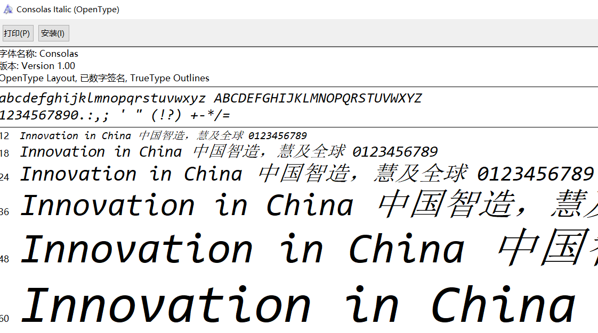
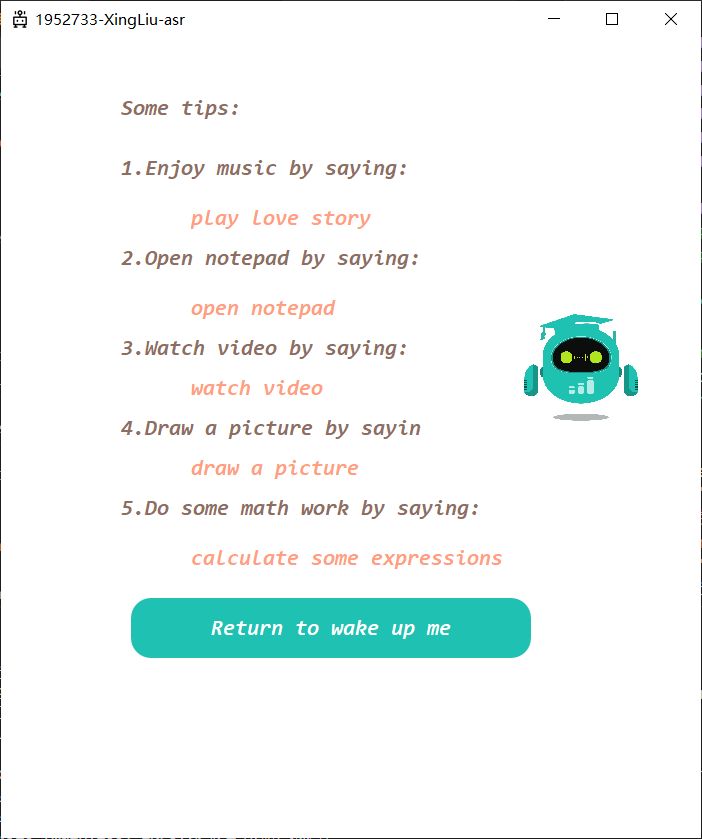
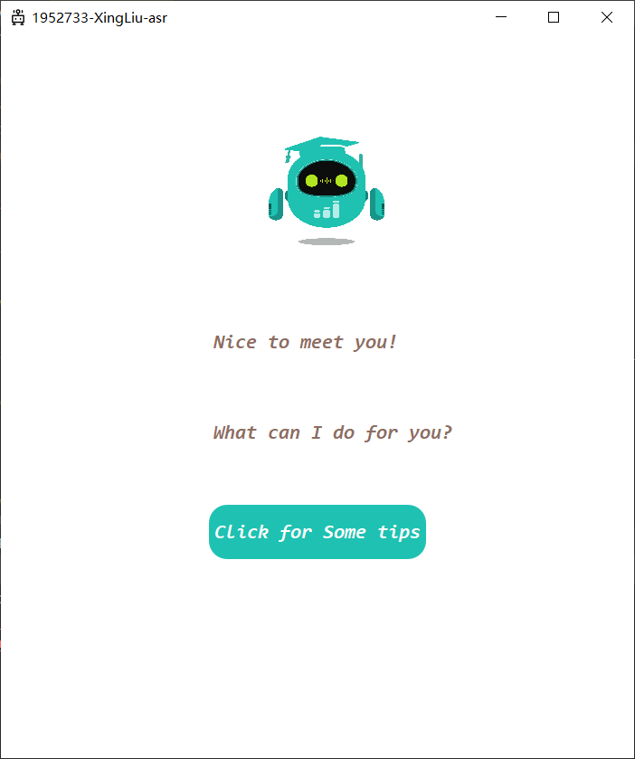
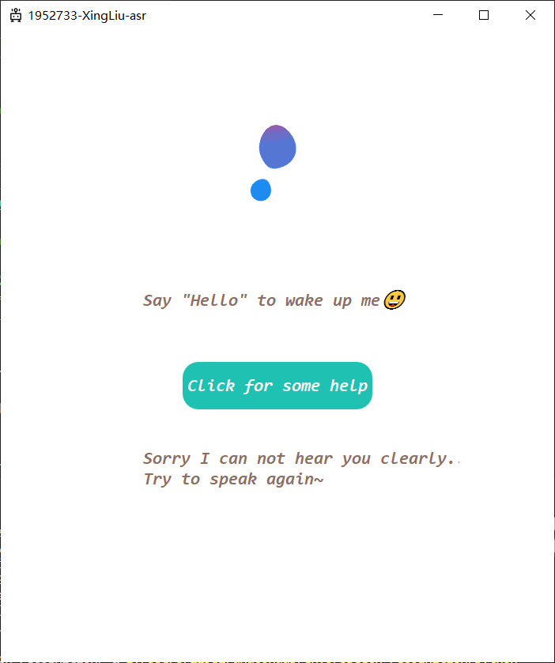
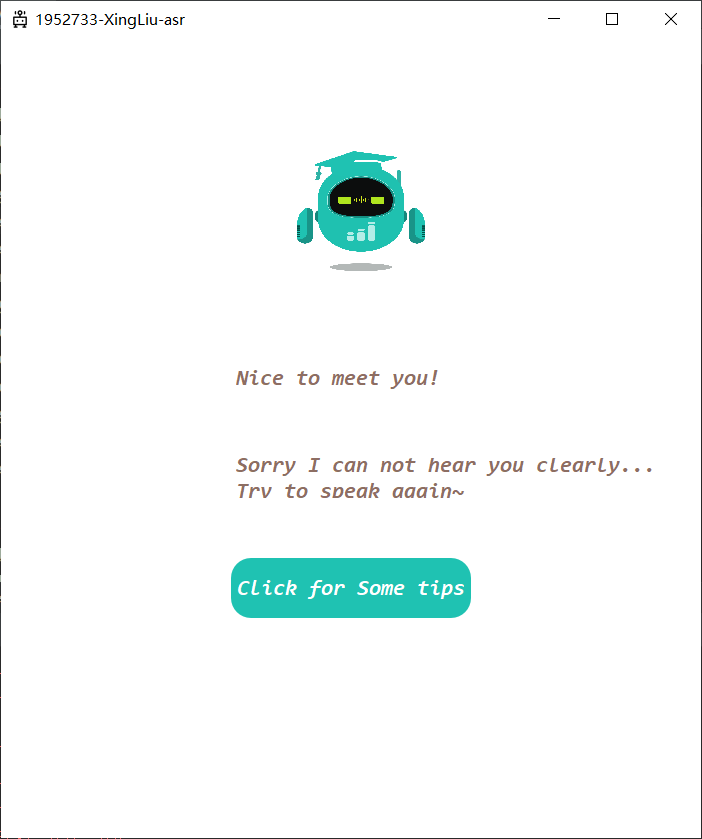
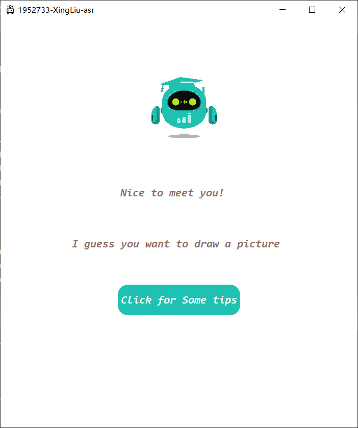
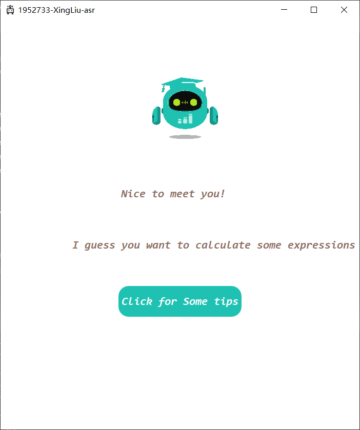

<!-- vscode-markdown-toc-config
	numbering=true
	autoSave=true
	/vscode-markdown-toc-config -->
<!-- /vscode-markdown-toc -->
<link rel="stylesheet" type="text/css" href="style.css"/>

# Lab1-Voice Recognition<!-- vscode-markdown-toc -->

| Name         | ID      |
| ------------ | ------- |
| Xing Liu | 1952733 |

<!-- vscode-markdown-toc -->
* 1. [Modifications](#Modifications)
	* 1.1. [GUI](#GUI)
		* 1.1.1. [Font](#Font)
		* 1.1.2. [Color](#Color)
		* 1.1.3. [GIF](#GIF)
		* 1.1.4. [Icon](#Icon)
		* 1.1.5. [Sleeping State](#SleepingState)
		* 1.1.6. [Help List](#HelpList)
		* 1.1.7. [Wake Up State](#WakeUpState)
		* 1.1.8. [Poor Recognizing State](#PoorRecognizingState)
		* 1.1.9. [Successful Recognizing State](#SuccessfulRecognizingState)
	* 1.2. [Code](#Code)
		* 1.2.1. [Notice and GIF](#NoticeandGIF)
		* 1.2.2. [Get audio input](#Getaudioinput)
		* 1.2.3. [Set the timer to loop](#Setthetimertoloop)
		* 1.2.4. [Configure log format](#Configurelogformat)
		* 1.2.5. [Similarity Detection](#SimilarityDetection)
		* 1.2.6. [Speech recognition](#Speechrecognition)
		* 1.2.7. [change the widget between main page and help page](#changethewidgetbetweenmainpageandhelppage)
		* 1.2.8. [wake up the system](#wakeupthesystem)
* 2. [Accuracy](#Accuracy)
	* 2.1. [Experiment](#Experiment)
		* 2.1.1. [Quiet Environment](#QuietEnvironment)
		* 2.1.2. [Slightly Noisy Environment](#SlightlyNoisyEnvironment)
		* 2.1.3. [Noisy Environment](#NoisyEnvironment)
		* 2.1.4. [Conclusions](#Conclusions)
	* 2.2. [Potential Improvement](#PotentialImprovement)

##  1. <a name='Modifications'></a>Modifications

###  1.1. <a name='GUI'></a>GUI
####  1.1.1. <a name='Font'></a>Font
I use the **Consolas-Italic** type font in my user interface, which is more friendly and beautiful to user.

<center>
    
    <div display="inline-block">font</div>
</center>


####  1.1.2. <a name='Color'></a>Color
The color of my user interface is changed, as the main colors in my user interface is light_brown, orange, light_green and white, which fits most people's taste.


####  1.1.3. <a name='GIF'></a>GIF
I change the default gifs in my user interface, which can be seen as [gif1](#gif1) and [gif2](#gif2) below.
<center>
    
    <div display="inline-block">sleep</div>
</center>

<br>
<center>
    
    <div display="inline-block">robot</div>
</center>

####  1.1.4. <a name='Icon'></a>Icon
I design my own icon below, which is [a cute robot](#icon).
<center>
    
    <div display="inline-block">icon</div>
</center>

####  1.1.5. <a name='SleepingState'></a>Sleeping State

<center>
    
    <div display="inline-block">Home page</div>
</center>

* Add notice “Clickfor some help” to remind user that he/she can check the help list by clicking the button.
* Add notice “Say 'Hello' to wake up me” to remind user he/she can wake up the assistant through saying "hello".

####  1.1.6. <a name='HelpList'></a>Help List

<center>
    
    <div display="inline-block">Help list</div>
</center>

* Add help list which can show the command can be recognized by the assistant: 
  * "play love story" to enjoy music--"love story".
  *  "open notepad" to record something through notepad.
  *  "watch video" to watch a video in __**"static"**__ folder.
  *  "draw a picture" to open the __**"mspaint.exe"**__ and draw something.
  *  "calculate some expressions" to solve some math problem.
* Add notice "Return to wake up me" to remind user that he/she can go back to the Home page by clicking this button.

####  1.1.7. <a name='WakeUpState'></a>Wake Up State
<center>
    
    <div display="inline-block">wakeup</div>
</center>

* Add animation effects,  highlight the wake-up effect and enhance the user’s sense of interaction.
* Add notice “What can I do for you” to illustrate user that he/she can speak some command.

####  1.1.8. <a name='PoorRecognizingState'></a>Poor Recognizing State

As sphinx sometimes get poor recognition rate, my user interface can label some hints to remind the user to speak again to command the system, which can be seen in [fig1](#poor_hear1) and [fig2](#poor_hear2).
<center>
    
    <div display="inline-block">poor_hear1</div>
</center>

<center>
    
    <div display="inline-block">poor_hear2</div>
</center>

####  1.1.9. <a name='SuccessfulRecognizingState'></a>Successful Recognizing State
When the command is successfully recognized, the system execute the command and display some hints in the user interface, which can be seen in these figures below.

<center>
    
    <div display="inline-block">music</div>
</center>

<center>
    
    <div display="inline-block">notepad</div>
</center>

<center>
    
    <div display="inline-block">video</div>
</center>

<center>
    
    <div display="inline-block">picture</div>
</center>
<center>
    
    <div display="inline-block">math</div>
</center>

###  1.2. <a name='Code'></a>Code

####  1.2.1. <a name='NoticeandGIF'></a>Notice and GIF

I simply design the notice and gif in ***MainWindow.py***, which can guide user how to interact whith the system.
```python
        self.Gif = QtWidgets.QLabel(self.widget)
        self.Gif.setGeometry(QtCore.QRect(150, 0, 400, 300))
        self.gif = QMovie(r"static\sleep.gif")
        self.Gif.setMovie(self.gif)
        self.gif.start()
        self.Gif.setScaledContents(True)
        self.Gif.setObjectName("sleep")

    def retranslateUi(self, MainWindow):
        _translate = QtCore.QCoreApplication.translate
        MainWindow.setWindowTitle(_translate("MainWindow", "MainWindow"))
        self.label_3.setText(_translate("MainWindow", ""))
        self.label_3_1.setText(_translate("MainWindow", "What can I do for you?"))
        self.label_1.setText(_translate("MainWindow", "Nice to meet you!"))
        self.helpButton.setText(_translate("MainWindow", "Click for some help"))
        self.helpButton.setFont(MyFont())
        self.label.setText(_translate("MainWindow", "Say \"Hello\" to wake up me😃"))
        self.sleepButton.setText(_translate("MainWindow", "Click for Some tips"))
        self.sleepButton.setFont(MyFont())
        self.label_4.setText(_translate("MainWindow", "Some tips:"))
        self.label_2.setText(_translate("MainWindow", "1.Enjoy music by saying:"))
        self.label_6.setText(_translate("MainWindow", "3.Watch video by saying:"))
        self.label_10.setText(_translate("MainWindow", "4.Draw a picture by saying:"))
        self.label_12.setText(_translate("MainWindow", "2.Open notepad by saying:"))
        self.label_13.setText(_translate("MainWindow", "5.Do some math work by saying:"))
        self.pushButton.setText(_translate("MainWindow", "Return to wake up me"))
        self.pushButton.setFont(MyFont())
```

####  1.2.2. <a name='Getaudioinput'></a>Get audio input

Detect the user's voice command through the microphone, automatically stop when the voice cannot be detected.

```python
def record(rate=16000):
    """
    record th audio
    :return:
    """
    mic = sr.Microphone(sample_rate=rate)
    with mic as source:
        # r.adjust_for_ambient_noise(source)
        audio = r.listen(source)
        return audio
```

####  1.2.3. <a name='Setthetimertoloop'></a>Set the timer to loop
When a command is recognized, the system should start another recognition, which can be solved by timer.
```python
    def set_timer(self):
        """
        set timer
        The timer needs to be turned off when switching to the help interface
        The timer is used for the call of the voice recognition task
        :return:
        """
        # self.recognize()
        self.isFinished = True
        self.timer = threading.Timer(self.interval, self.recognize)
        self.timer.start()
        return
```

####  1.2.4. <a name='Configurelogformat'></a>Configure log format
As clear log format instead of simply ***"print"*** can help us better understand the condition of the system, I configure the log format at the beginning of ***main.py***.
```python
log_format = "%(asctime)s (%(module)s:%(lineno)d) %(levelname)s:%(message)s"
logging.basicConfig(level=logging.INFO, format=log_format)
```

####  1.2.5. <a name='SimilarityDetection'></a>Similarity Detection

Use the SuquenceMatcher of the difflib library to perform similarity detection and return the similarity of the two strings to be compared.

```python

def compare_str(str1, str2):
    """
    Compare the similarity between the two words
    :param str1:
    :param str2:
    :return:
    """
    return difflib.SequenceMatcher(None, str1, str2).quick_ratio()
```

####  1.2.6. <a name='Speechrecognition'></a>Speech recognition

I set a timer in recognition part, which serves the functionality as a loop. In this part, the audio can be recognized by function __**recognize_sphinx**__, after that, the system execute the command, or output the hint that no command was recognized.

```python
def recognize(self):
        """
        speech recognition function
        :return:
        """
        if not self.isFinished:
            logging.info("The last speech recognition process has not ended")
            return
        else:
            self.isFinished = False
            # self.timer.blockSignals(True)
            if self.isWaked:
                try:
                    audio = record()
                except UserWarning:
                    logging.warning("Failed to read audio from microphone")
                    self.set_timer()
                    return
                else:
                    logging.info("Read audio input successfully")
                    try:
                        word = r.recognize_sphinx(audio)

                    except Warning:
                        logging.warning("speech recognition failed")
                        self.set_timer()
                        return
                    else:
                        logging.info("The recognized word is %s", word)
                        ratio_list = [compare_str(word, command) for command in self.words]
                        max_ratio = max(ratio_list)
                        max_ratio_index = ratio_list.index(max_ratio)
                        if max_ratio < 0.55:
                            logging.warning("Can't figure out what to do")
                            logging.info("The recognition similarity is %s", max_ratio)
                            self.poor_hear()
                            self.set_timer()
                            return
                        # words = ['Music', 'Notepad', 'Video', 'Paint', 'Math']
                        logging.info("The recognition similarity is%s", max_ratio)
                        logging.info("The recognized command is %s", self.words[max_ratio_index])
                        self.output(self.words[max_ratio_index])

                        if max_ratio_index == 0:
                            try:
                                os.startfile(r"static\LoveStory.mp3")
                            except ResourceWarning:
                                logging.warning("Failed to open audio")
                                self.set_timer()
                                return

                        elif max_ratio_index == 1:
                            try:
                                os.system(r"C:\Windows\System32\notepad.exe")
                            except ResourceWarning:
                                logging.warning("Failed to open notepad")
                                self.set_timer()
                                return

                        elif max_ratio_index == 2:
                            try:
                                os.startfile(r"static\video.mp4")
                            except ResourceWarning:
                                logging.warning("Failed to open video")
                                self.set_timer()
                                return

                        elif max_ratio_index == 3:
                            try:
                                os.system(r"C:\Windows\System32\mspaint.exe")
                            except ResourceWarning:
                                logging.warning("Failed to open paint tool")
                                self.set_timer()
                                return

                        elif max_ratio_index == 4:
                            try:
                                os.system(r"C:\Windows\System32\calc.exe")
                            except ResourceWarning:
                                logging.warning("Failed to open calculator")
                                self.set_timer()
                                return
                        else:
                            logging.warning("unknown error!")
                            self.set_timer()
                            return
            else:
                try:
                    audio = record()
                except UserWarning:
                    logging.warning("Failed to read audio from microphone")
                    self.set_timer()
                    return
                else:
                    logging.info("Read audio input successfully")
                    try:
                        word = r.recognize_sphinx(audio)
                    except Warning:
                        logging.warning("speech recognition failed")
                        self.set_timer()
                        return
                    else:
                        wake_up_ratio = compare_str(word, "Hello")
                        logging.info("The similarity with Hello is:%s", wake_up_ratio)
                        if wake_up_ratio > 0.3:
                            self.change_wake_sleep()
                        else:
                            self.poor_hear()
        self.set_timer()
        return
```

####  1.2.7. <a name='changethewidgetbetweenmainpageandhelppage'></a>change the widget between main page and help page

Click the button to change the view.

* isNotHelp == 0：in main page
* isNotHelp != 0: in help page：

```python
    def change_main_help(self):
        """
        change_main_help user interface
        :return:
        """
        self.isNotHelp = not self.isNotHelp
        self.update_widget()
```

####  1.2.8. <a name='wakeupthesystem'></a>wake up the system
Say ***hello*** to wake up the system.

* isWaked == 0：in wake-up state
* isWaked != 0: in sleeping state：
```python
def change_wake_sleep(self):
        self.isWaked = not self.isWaked
        self.update_widget()
```

##  2. <a name='Accuracy'></a>Accuracy

###  2.1. <a name='Experiment'></a>Experiment

In order to ensure that the results of the experiment are not affected by the testers’ pronunciation standards, the pronunciations of the following experiments are all American pronunciations of <kbd>`Youdao Dictionary`</kbd>.  At the same time, in order to be as close as possible to the user's using of the voice assistant, the test voice is played with mobile phone against the microphone of the computer during the test.

####  2.1.1. <a name='QuietEnvironment'></a>Quiet Environment

Almost no noise.

| ID   | Voice                      | Recognition Results       | Similarity |
| ---- | ---------------------------| --------------------------| ---------- |
| 1    | hello                      | Hello                     | 1.0        |
| 2    | hello                      | Hello                     | 1.0        |
| 3    | play love story            | they and those dowry      | 0.67       |
| 4    | play love story            | well                      | 0.67       |
| 5    | open notepad               | o'connor not headed       | 0.58       |
| 6    | open notepad               | not headed                | 0.58       |
| 7    | watch video                | diagnose dowry            | 0.62       |
| 8    | watch video                | diagnose dowry            | 0.62       |
| 9    | draw a picture             | and now starring          | 0.58       |
| 10   | draw a picture             | draw a picture            | 0.78       |
| 11   | calculate some expressions | last week here on why should we do| 0.68       |
| 12   | calculate some expressions | last week here on hey        | 0.68       |

####  2.1.2. <a name='SlightlyNoisyEnvironment'></a>Slightly Noisy Environment

Tested in a dormitory environment, only minor activities of the roommates.

| ID   | Voice                      | Recognition Results       | Similarity |
| ---- | ---------------------------| --------------------------| ---------- |
| 1    | hello                      | the yellow                | 0.16       |
| 2    | hello                      | Hello                     | 0.63       |
| 3    | play love story            | diagnosed gallery         | 0.56       |
| 4    | play love story            | diagnosed gallery         | 0.56       |
| 5    | open notepad               | manos doubting            | 0.61       |
| 6    | open notepad               | hello                     | 0.61       |
| 7    | watch video                | i think                   | 0.56       |
| 8    | watch video                | i think                   | 0.56       |
| 9    | draw a picture             | mary thank              | 0.57       |
| 10   | draw a picture             | mary thank              | 0.57       |
| 11   | calculate some expressions | they announced gallery    | 0.62       |
| 12   | calculate some expressions | they announced gallery    | 0.62       |

####  2.1.3. <a name='NoisyEnvironment'></a>Noisy Environment 

Tested in a playground environment, relatively noisy environment.
| ID   | Voice                      | Recognition Results       | Similarity |
| ---- | ---------------------------| --------------------------| ---------- |
| 1    | hello                      | they don't                | 0.26       |
| 2    | hello                      | hello                     | 0.8        |
| 3    | play love story            | a louse barry             | 0.34       |
| 4    | play love story            | a louse barry             | 0.53       |
| 5    | open notepad               | hello                     | 0.46       |
| 6    | open notepad               | hello                     | 0.36       |
| 7    | watch video                | and it shows them         | 0.53       |
| 8    | watch video                | i think                   | 0.56       |
| 9    | draw a picture             | mary i think              | 0.54       |
| 10   | draw a picture             | mary i think              | 0.52       |
| 11   | calculate some expressions | work                      | 0.46       |
| 12   | calculate some expressions | they did                  | 0.42       |

####  2.1.4. <a name='Conclusions'></a>Conclusions

When it's very quiet, the recognition accuracy is relatively high. However, it largely ranges as instruction changes, for example 'hello' and 'watch vedio' are easier to be recognized than other instructions.

When there is little noise, the accuracy is lower, as it sometimes can not recognize correctly.

When there is environmental noise, the effect is very poor, and it is almost impossible to recognize, and the following two kinds of wrong recognition will occur:

* The instruction has been said, but the detection doesn't  stop, and the environmental noise is recognized as a word.
* One word is recognized as multiple shorter words.
* The instruction is recognized as a similarly pronounced word, such as ***"watch vedio"*** and ***"draw a picture"***.

###  2.2. <a name='PotentialImprovement'></a>Potential Improvement

* Recognition accuracy
  * we can reduce the impact of environmental sounds by adding some denoising algorithms, which makes the speech relatively smoother, while filtering out some slight sounds, and increasing the detection sensitivity of the end of the speech.
  * we can use other speech recognition methods, including baidu api and xfyun api to improve the accuracy, as sphinx is not accurate enough.
  * we can use deep learning methods to design a recognizing model to recognize chinese language, such as [ASRT_SpeechRecognition](https://github.com/nl8590687/ASRT_SpeechRecognition).
* User Interface 
  * Animation interaction can be further increased, such as updating the animation in the recognition process, and real-time synchronization with the recognition, which can more effectively reflect the recognition in progress.
  * [qt-material](https://github.com/UN-GCPDS/qt-material) can be used in interface design, which would make design easier.
