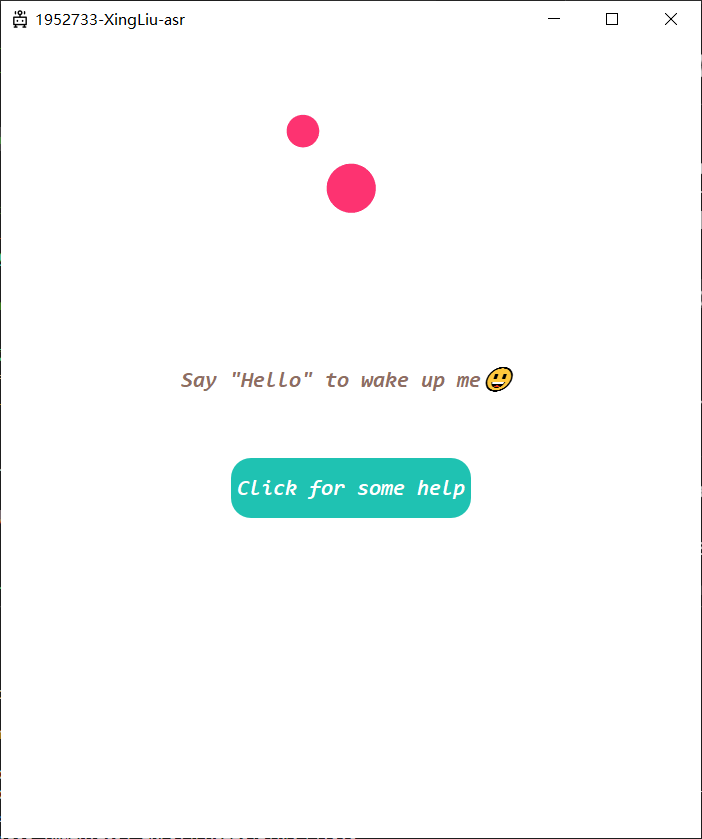

<!-- vscode-markdown-toc -->
* 1. [Voice Recognition](#VoiceRecognition)
	* 1.1. [How to run this code](#Howtorunthiscode)
	* 1.2. [Structure](#Structure)
	* 1.3. [Environment](#Environment)
	* 1.4. [User interaction](#Userinteraction)

<!-- vscode-markdown-toc-config
	numbering=true
	autoSave=true
	/vscode-markdown-toc-config -->
<!-- /vscode-markdown-toc -->
<link rel="stylesheet" type="text/css" href="style.css"/>

# Human-Computer-Interaction


##  1. <a name='VoiceRecognition'></a>Voice Recognition

###  1.1. <a name='Howtorunthiscode'></a>How to run this code
* In pycharm,create a project and set the version of python as **3.6**, the name of the project does not matter.
* run ```pip install -r requirements.txt``` in terminal.
* run main.py in pycharm and test.

###  1.2. <a name='Structure'></a>Structure

```
├── main.py
├── MainWindow.py
├── requirements.txt
└── static
    ├── Consolas-Italic.ttf
    ├── icon.png
    ├── LoveStory.mp3
    ├── main.qss
    ├── robot.gif
    ├── sleep.gif
    └── video.mp4
```

###  1.3. <a name='Environment'></a>Environment
* **Operating System**: Windows 10
* **IDE**: Pycharm 2021.3.1
* **Programming Language**: Python


###  1.4. <a name='Userinteraction'></a>User interaction

*  Say "hello" to **Wake up** the assistant

<center>
  
</center>

* Click the button **"Click for some tips"** to show the help list

<center>
  
</center>

* Click the button **"Return to chat with me"** to show the help list

<center>
  
</center>


* once wake up the assistant, say different instructions to use different functions.

  * Play love story --> wake up the music player and play the music
  
  * Open notepad --> wake up the notepad.

  * Watch video --> play video in ***static*** folder. 

  * Draw a picture --> open mspaint.exe to paint.
    
  * Calculate some expressions --> open the calculator.